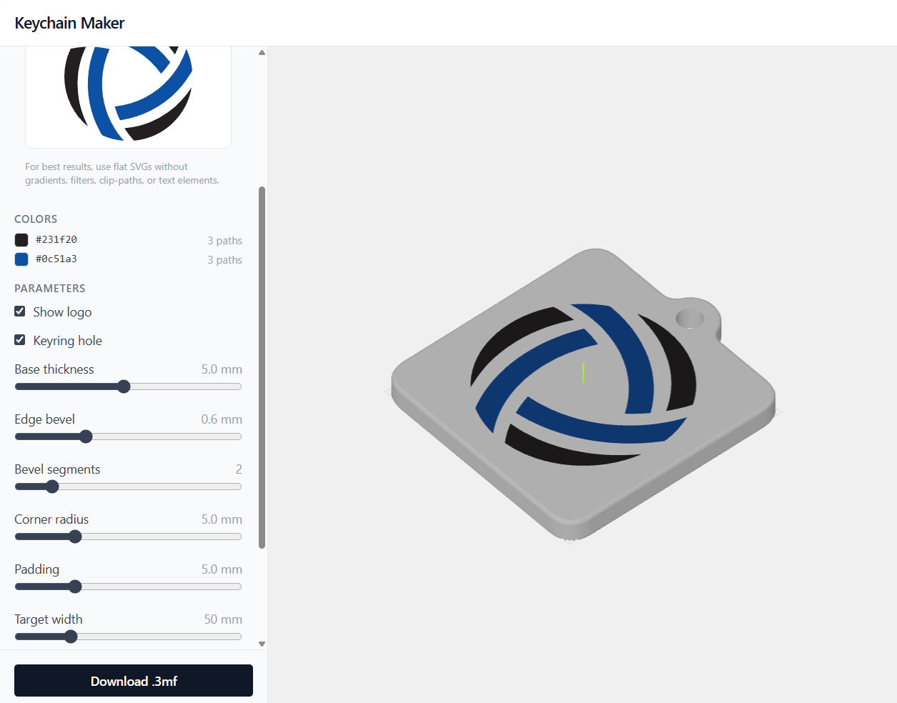
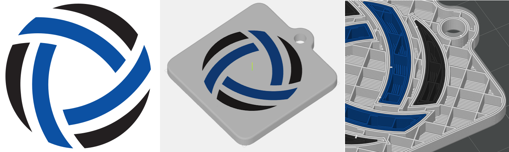

# Keychain Maker

Turn a flat SVG logo into a 3D-printable, multi-color keychain directly in the browser.

[Try the live app](https://andzhik.github.io/keychain-maker/)



## What it makes

Keychain Maker takes a clean, filled SVG, separates its shapes by color, builds a beveled base plate with an optional keyring hole, and exports a slicer-ready `.3mf` file.



## Highlights

- Upload an SVG logo and preview it immediately in 3D
- Preserve logo colors as separate printable materials
- Tune base thickness, bevel, corner radius, padding, logo height, and target size
- Add or remove the keyring hole
- Inspect the model with an interactive Three.js viewport
- Export a multi-color `.3mf` for modern slicers

## Best SVG Inputs

For the cleanest geometry, use simple SVG artwork made from filled paths.

- Convert text to paths before uploading
- Avoid gradients, filters, clip paths, masks, and embedded images
- Prefer logos with clear color regions and moderate path complexity

## Tech Stack

- Vue 3 with `<script setup>` and TypeScript
- Three.js for geometry, lighting, camera controls, and viewport rendering
- `three-bvh-csg` for the keyring-hole boolean operation
- `three-3mf-exporter` for multi-color `.3mf` export
- Tailwind CSS v4
- Vite 6 and Bun

## Local Development

```bash
bun install
bun run dev
```

Then open the local URL printed by Vite, usually `http://localhost:5173`.

## Scripts

| Command | Description |
| --- | --- |
| `bun run dev` | Start the Vite dev server |
| `bun run build` | Type-check and build for production |
| `bun run preview` | Preview the production build |
| `bun run render [svg] [config]` | Capture headless render snapshots |

## Render Snapshots

`bun run render` drives the real build pipeline in headless Chromium and writes PNG snapshots to `test-output/` for offline inspection. The default capture set includes isometric, back-isometric, top, front, and back views.

```bash
bunx playwright install chromium
bun run render
bun run render test-svg/c1.svg '{"edgeBevel":0}'
```

The render harness lives in `test-render/` and runs under Node because Playwright's browser pipe transport hangs under Bun.

## Deployment

The app is deployed to GitHub Pages from the workflow in `.github/workflows/`. The Vite base path is controlled by `VITE_BASE_PATH`, so the same build can target local preview or the published Pages path.
